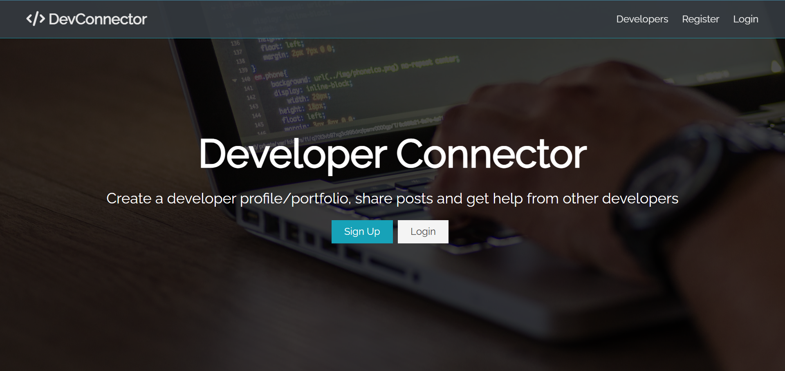

# Developer Connector



## About

This is a social network where developers can create profiles, like and share posts, and comment on those posts.

## Dependencies

This app was created using the MERN stack. It uses JWTs for authentication, Redux for state management, and integrates with Gravatar and GitHub for the user's profile.

## Directions

This app is hosted on Heroku at [https://pacific-beyond-32083.herokuapp.com](https://pacific-beyond-32083.herokuapp.com/), or can be run locally using the following steps:

1. [Clone](https://github.com/Abhiek187/devconnector.git) this repo.
2. Install all the server and client dependencies:

```bash
npm install # server
npm install --prefix client # client
```

3. Create file called `default.json` in the `config` directory and populate it with the following:

```json
{
  "mongoURI": "YOUR_MONGODB_URI",
  "jwtSecret": "YOUR_SECRET_TOKEN",
  "githubToken": "YOUR_GITHUB_PAT"
}
```

You will need to create a MongoDB database with collections for the posts, profiles, and users. The JWT secret can be any random string. And the GitHub token can be obtained by following [these directions](https://docs.github.com/en/authentication/keeping-your-account-and-data-secure/creating-a-personal-access-token).

4. Run the Node server and React app concurrently using `npm run dev`, which will open the project at `http://localhost:3000` while the server listens at `http://localhost:5000`. Both can be stopped by pressing CTRL-C.
